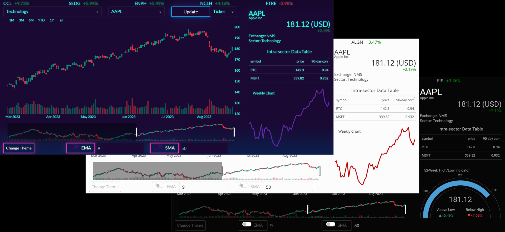
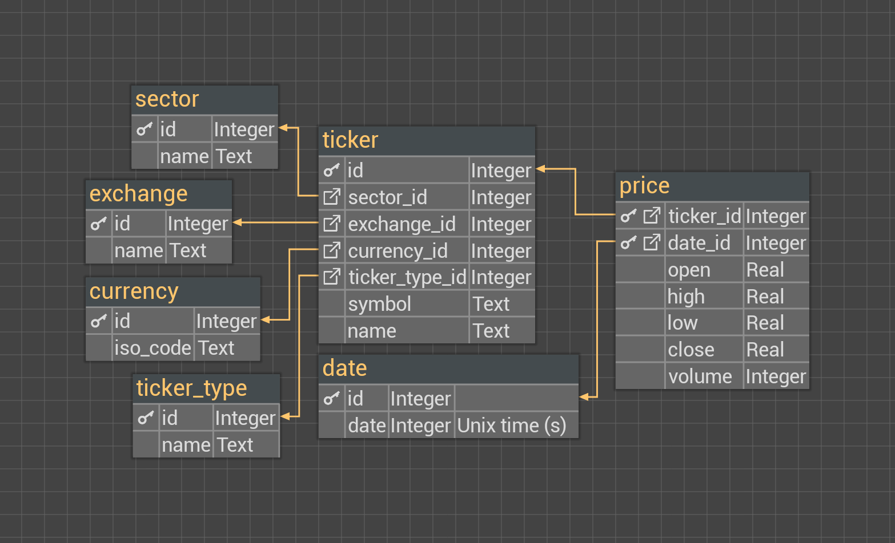
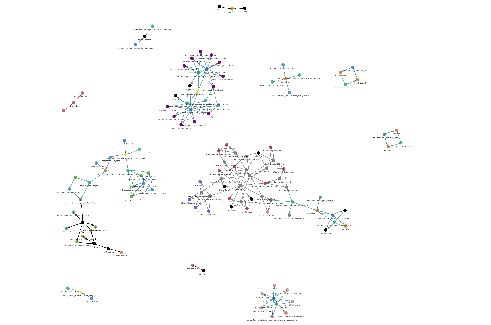
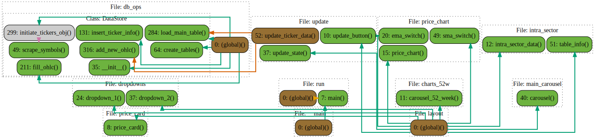
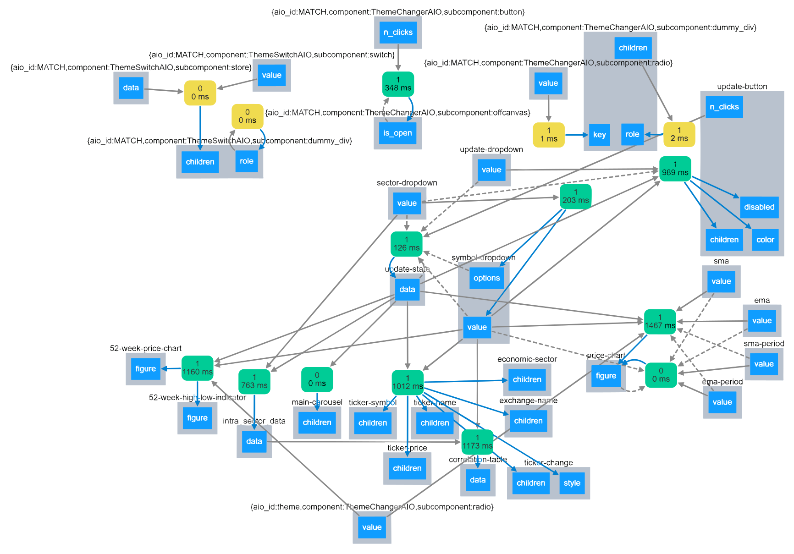

<!-- better use an svg -->
<div align="center">
    
</div>

-------

# innov8finance: interactive market dashboard [%E2%81%A0%EF%BE%89-966FD6?style=for-the-badge)](https://github.com/mayushii21)

<div align="center">

[](https://pypi.org/project/innov8/)

[](https://www.codefactor.io/repository/github/mayushii21/market-dashboard)
[](https://github.com/mayushii21/market-dashboard/actions/workflows/tests.yml)
[](https://codecov.io/gh/mayushii21/market-dashboard)
[](https://github.com/psf/black)
[](LICENSE)

</div>

**innov8finance** is a versatile market dashboard designed to meet the needs of traders, offering an innovative alternative to Tradingview, with a plethora of aesthetically pleasing themes to choose from. It provides users with the convenience of accessing the platform online or hosting it locally on their machine. This allows traders to have uninterrupted access to historical tick data even when the grid is down, ensuring they can backtest their trading strategies anytime, anywhere. Experience the power of innov8finance for reliable and efficient trading analysis.

> LEGAL DISCLAIMER  
This project is intended for research and educational purposes only.

## Main Features

- **Full List of S&P 500 Component Stocks:** Access data for stocks from some of the largest companies in the United States.
- **Economic Sector Filtering:** Easily filter stocks by economic sector.
- **Trending Stocks:** Stay updated with the most active and volatile stocks.
- **Daily Candlestick Price Charts:** Access daily candlestick price charts for stocks.
- **Stock Information:** Obtain comprehensive stock information, including the symbol, company name, current price and change, the stock's exchange, and sector.
- **Intra-sector Data:** Explore data such as the 90-day correlation and prices among stocks within the same sector.
- **52-Week Charts:** View weekly closing prices, the high/low range, and changes for the past 52 weeks.
- **Cross-Platform Functionality:** Enjoy a seamless experience across different platforms.
- **Online and Offline Accessibility:** Access the application both online and offline.
- **Aesthetic Themes:** Choose from 6 dark and 9 light aesthetically pleasing themes.

## Usage and Installation

The online version of the tool can be accessed at <http://innov8finance.pythonanywhere.com> or its backup at <https://innov8.onrender.com> (note that the web server on the backup link may take a few minutes to load since it automatically spins down after 15 minutes of inactivity and needs to be reawakened).

It is highly recommended to install a local version for optimal performance and faster rendering. **innov8finance** requires Python to run. The latest version can be downloaded and installed from [https://www.python.org](https://www.python.org/downloads/). The package is available on [PyPI](https://pypi.org/project/innov8/) and can be easily installed using pip:

```bash
pip install innov8
```

Once the installation is complete, you can run the tool from your terminal with a simple command:

```bash
innov8
```

The app is designed to be platform-agnostic, supporting Windows, Linux, and macOS operating systems.

## Development

**innov8finance** utilizes Dash and Plotly for the front end, and Pandas and SQLite for the back end. Data is acquired from Yahoo! Finance's API and stored in an SQLite database. Necessary data is then queried and loaded into a Pandas DataFrame for further manipulation. Interactive charts are generated using Plotly and seamlessly integrated into the Dash app's layout, alongside other components, resulting in a smooth dashboard experience.

The choice of database (SQLite) was mainly influenced by hosting platform limitations. Ideally, a timeseries database such as TimeScaleDB (employing a hypertable to store tick data and utilizing a time_bucket for interval aggregation) or a fast column-oriented DBMS such as ClickHouse would have been preferred. Furthermore, if storage space limitations were not a concern, implementing a materialized view paired with a trigger for concurrent refreshment could significantly enhance performance.

Considering contextual factors encompassing application requirements, development constraints, project goals, and other pertinent aspects, the database is structured in a normalized manner to handle data anomalies and the following schema has been decided on:

<div align="center">
    
</div>

Primary keys and attributes with unique constraints are automatically indexed and remain unaltered. On the other hand, indexes on foreign keys are not generated automatically, so, to speed up querying, a composite index is created on the foreign keys of the `ticker` table.

Order of composite indexes:

- `ticker` table - `sector_id` -> `exchange_id` -> `currency_id` -> `ticker_type_id`
- `price` table (composite primary key) - `ticker_id` -> `date_id`  

The `DataStore` class in the [`db_ops`](src/innov8/db_ops.py) module is responsible for handling data-related operations. This includes managing and updating the database, as well as loading the main DataFrame used by the Dash components. The Dash `app` is initialized within the [`app`](src/innov8/app.py) module. Additionally, two convenience decorators are created in the [`decorators`](src/innov8/components/decorators.py) module within the [`components`](src/innov8/components) folder. These decorators facilitate passing data and registering callbacks. Components and their respective callbacks are grouped and stored in separate modules within the [`components`](src/innov8/components) folder. All these components are then consolidated into the final app layout, located in the root directory of the package, specifically within the [`layout`](src/innov8/layout.py) module. Finally, the app is imported from the [`layout`](src/innov8/layout.py) module into the [`run`](src/innov8/run.py) module, which serves as the entry point for running the app. For deployment, a `server` variable is also created within the [`run`](src/innov8/run.py) module to be used with `gunicorn`.

Below is a helpful static call graph designed to assist in familiarizing oneself with and understanding the codebase. It illustrates the calling relationships between subroutines within the program, providing an interprocedural view of the code.

<div align="center">
    
</div>

The following diagram presents a simplified call graph:

<div align="center">
    
</div>

Note that callbacks are not depicted in the call graphs since they are not explicitly called in the code, but are implicitly triggered and executed by the Dash `app` when the `Input` to a callback function changes. When a user interacts with a Dash component, it triggers the associated callback function to run. Dash captures the input values from the components and provides them as arguments to the callback function. The callback function then performs the necessary computations or updates based on the input values and returns the updated output values.

The following Dash callback graph displays a visual representation of the callbacks: which order they are fired in, how long they take, and what data is passed back and forth.

<div align="center">
    
</div>

> Note: Early development of the MVP can be viewed in the Jupyter Notebooks located within the [archive](archive) folder.

#### Roadmap

- **Move Indicators**: Consolidate indicators, along with settings and a color picker, into a single drop-up element.
- **Add Additional Indicators**: Incorporate VWAP, RSI, MACD, Parabolic SAR, ATR, and other indicators.
- **Database Migration**: Transition from SQLite to TimeScaleDB or ClickHouse for improved data management.
- **Switch Data Manipulation Library**: Replace Pandas with Polars to enhance efficiency for data manipulation tasks.
- **Multiple Timeframes**: Introduce support for multiple timeframes and include an interval selection button group.
- **Code Optimization**: Optimize the code by implementing client-side callbacks using JavaScript where appropriate.
- **Enhanced User Interface**: Implement dbc.Progress to transform the update button behavior (replace loading).
- **Visual Improvements**: Enrich sector and symbol dropdowns by adding components as option labels, including scraped and added SVGs.
- **Filter & Search Enhancement**: add truncated ticker names as greyed-out hints, as well as custom search terms for the symbol dropdown.
- **Machine Learning Integration**: Train an LSTM model for predicting OHLC (Open, High, Low, Close) data.
- **Advanced Analytics & Explainable AI Page**: Develop a second page featuring additional analytical tools for enhanced insights, such as SHAP, PDP, and other tools to increase transparency and interpretability of the ML model.

## License

[BSD 3-Clause License](LICENSE)  
Copyright (c) 2023, mayushii21

## Contact

Telegram: [@mayushii21](https://t.me/mayushii21)  
Email: <the.real.mayushii21@gmail.com>
